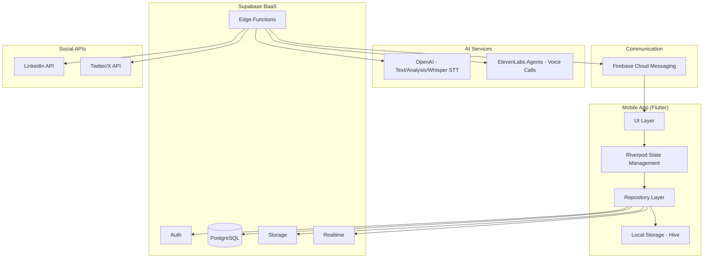
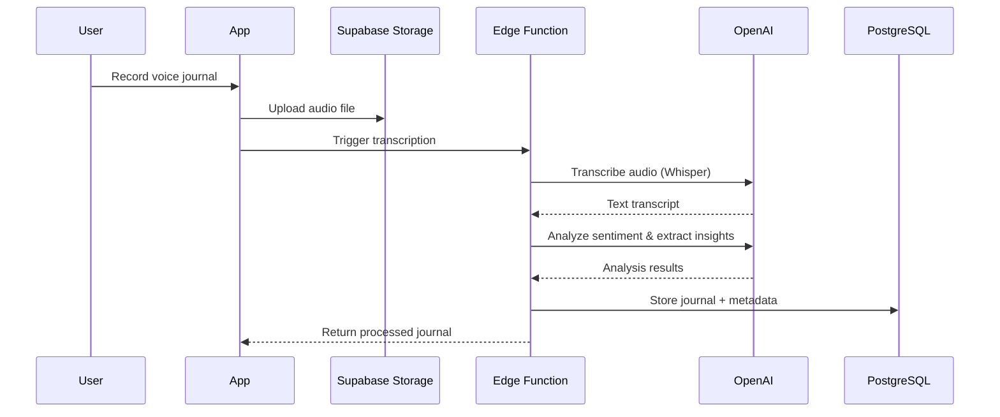
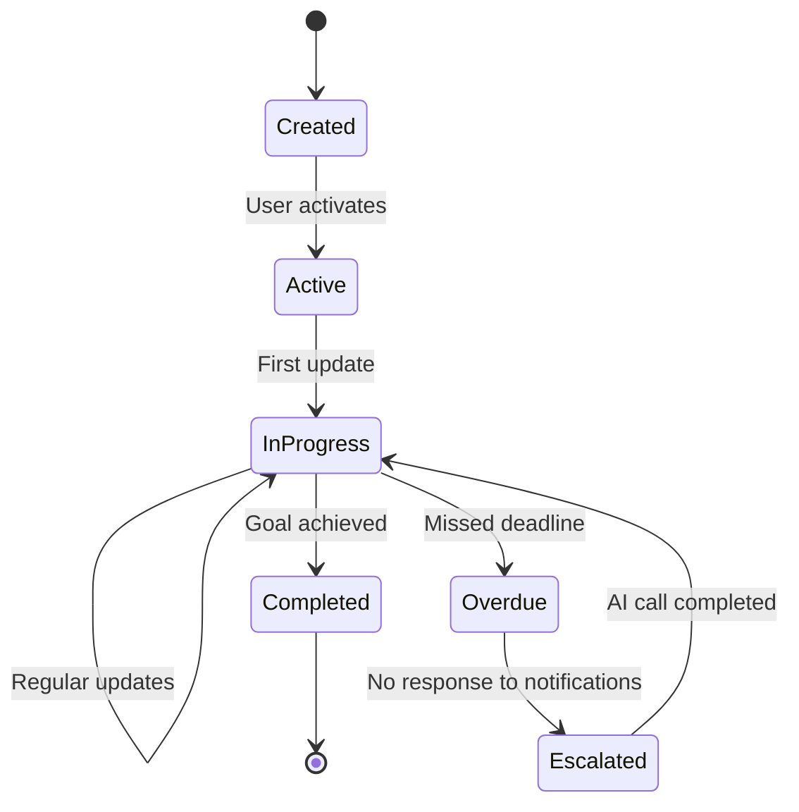
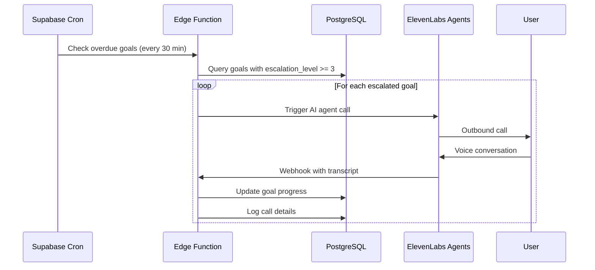
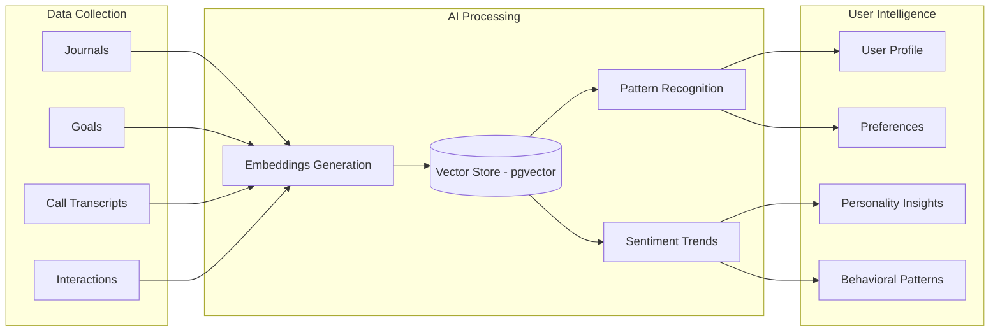

# ClarityLog

AI-powered productivity app with journaling, goal tracking, and smart reminders.

## Features

- 📓 **Smart Journaling** - Voice and text journaling with AI transcription
- 🎯 **Goal Tracking** - Set and track personal and professional goals
- 🔔 **Smart Reminders** - AI-powered reminder system with escalation
- � **AI Phone Calls** - ElevenLabs-powered voice calls for accountability
- �📊 **Progress Analytics** - Visual charts and insights
- 🔄 **Offline First** - Works offline with automatic sync
- 🤖 **AI Insights** - Personality and productivity pattern analysis
- 📱 **Social Sharing** - Generate and post content to LinkedIn/Twitter

---

## Architecture

### System Overview

### Voice Journaling Flow

### Goal Lifecycle

### AI Call System (ElevenLabs Agents)

### Self-Improving AI Profile

---

## Tech Stack

| Layer | Technology |
|-------|------------|
| **Frontend** | Flutter, Riverpod |
| **Backend** | Supabase (Auth, PostgreSQL, Storage, Edge Functions) |
| **Local Storage** | Hive |
| **AI - Text** | OpenAI (GPT-4, Whisper) |
| **AI - Voice** | ElevenLabs Agents Platform |
| **Push Notifications** | Firebase Cloud Messaging |
| **Social** | LinkedIn API, Twitter/X API |

---

## Escalation Levels

| Level | Action | Timing |
|-------|--------|--------|
| 0 | No action | - |
| 1 | Push notification | At reminder time |
| 2 | Push + In-app reminder | +2 hours after missed |
| 3 | AI phone call | +6 hours or next day AM |

